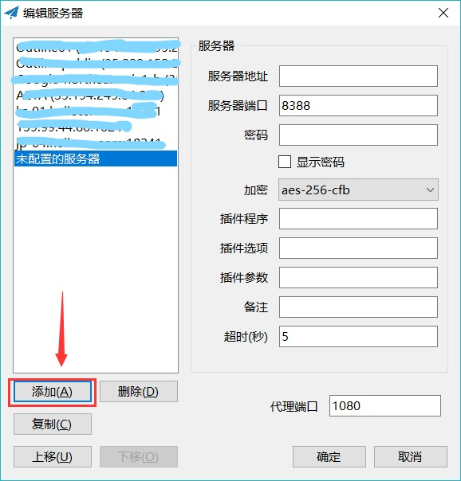
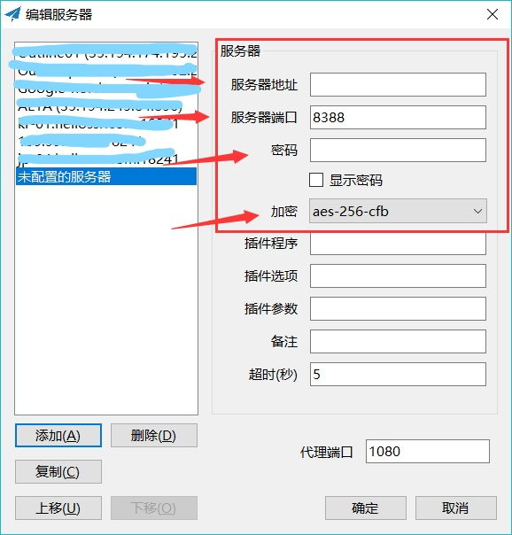
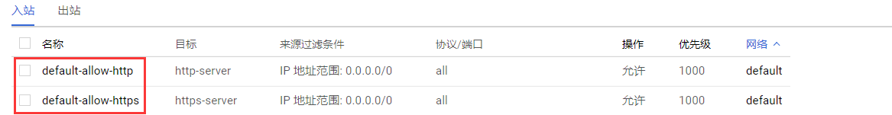
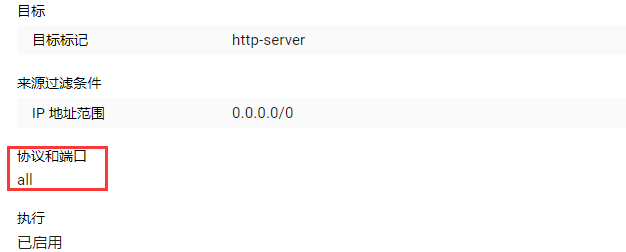
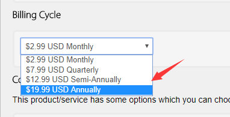
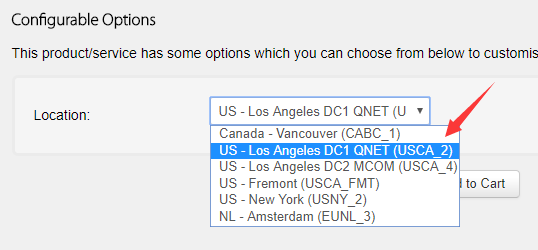

# 穿透网络防火长城全指南

## 网络防火长城（GFW）介绍

详细内容参考维基百科：https://zh.wikipedia.org/wiki/%E9%98%B2%E7%81%AB%E9%95%BF%E5%9F%8E

### 简介

防火长城（英语：Great Firewall (of China)，常用简称：GFW，中文也称中国国家防火墙，中国大陆民众俗称墙、防火墙、功夫网等等），是对中华人民共和国政府在其互联网边界审查系统（包括相关行政审查系统）的统称。此系统起步于1998年[3]，其英文名称得自于2002年5月17日Charles R. Smith所写的一篇关于中国网络审查的文章《The Great Firewall of China》，取与Great Wall（长城）相谐的效果，简写为Great Firewall，缩写GFW。随着使用的拓广，中文“墙”和英文“GFW”有时也被用作动词，网友所说的“被墙”即指网站内容被防火长城所屏蔽或者指服务器的通讯被封阻，“翻墙”也被引申为突破网络审查浏览境内外被屏蔽的网站或使用服务（如被GFW屏蔽的网盘Dropbox）的行为。

### 主要技术

#### 域名解析服务缓存污染

原理：防火长城对所有经过骨干出口路由的在UDP的53端口上的域名查询进行IDS入侵检测，一经发现与黑名单关键词相匹配的域名查询请求，防火长城会马上伪装成目标域名的解析服务器给查询者返回虚假结果。由于通常的域名查询没有任何认证机制，而且域名查询通常基于的UDP协议是无连接不可靠的协议，查询者只能接受最先到达的格式正确结果，并丢弃之后的结果。用户若改用TCP在53端口上进行DNS查询，虽然不会被防火长城污染，但可能会遭遇连接重置，导致无法获得目标网站的IP地址。

IPv6协议时代部署应用的DNSSEC技术为DNS解析服务提供了解析数据验证机制，可以有效抵御劫持。

全球一共有13组根域名服务器（Root Server），2010年中国大陆有F、I、J这3个根域DNS镜像，但曾因为多次DNS污染外国网络，威胁互联网安全和自由，北京的I根域服务器曾被断开与国际互联网的连接。目前已恢复服务。

从2002年左右开始，中国大陆的网络安全单位开始采用域名服务器缓存污染技术，防止了一般民众访问被过滤的网站。对于含有多个IP地址或经常变更IP地址逃避封锁的域名，防火长城通常会使用此方法进行封锁，具体方法是当用户从境内向境内DNS服务器提交域名请求时，DNS服务器要查询根域名服务器，此过程会受防火长城污染。而用户不做任何保护措施直接查询境外DNS时，会受防火长城污染。
当用户从境外查询境内服务器（不一定是有效DNS服务器），结果也会被污染。
2010年3月，当美国和智利的用户试图访问热门社交网站如facebook.com和youtube.com还有twitter.com等域名，他们的域名查询请求转交给中国控制的DNS根镜像服务器处理，由于这些网站在中国被封锁，结果用户收到了错误的DNS解析信息，这意味着防火长城的DNS污染已影响国际互联网。
2010年4月8日，中国大陆一个小型ISP的错误路由数据，经过中国电信的二次传播，扩散到了整个国际互联网，波及到了AT&T、Level3、德国电信、Qwest和西班牙电信等多个国家的大型ISP。
2012年11月9日下午3点半开始，防火长城对Google的泛域名*.google.com进行了大面积的污染，所有以.google.com结尾的域名均遭到污染而解析错误不能正常访问，其中甚至包括不存在的域名，而Google为各国定制的域名也遭到不同程度的污染（因为Google通过使用CNAME记录来平衡访问的流量，CNAME记录大多亦为.google.com结尾），但Google拥有的其它域名如.googleusercontent.com等则不受影响。有网友推测Google被大面积阻碍连接是因为中共正在召开的十八大。
2014年1月21日下午三点半，中国网站的.com域名解析不正常，网站被错误地解析至65.49.2.178，该IP位于美国北卡罗来纳州的Dynamic Internet Technology，即自由门的开发公司。据推测，可能是操作失误造成的事故。
2015年1月2日起，污染方式升级，不再是解析到固定的无效IP，而是随机地指向境外的有效IP。刚开始只是对YouTube视频域名（*.googlevideo.com）进行处理，之后逐渐扩大到大多数被污染的域名。[22]这导致了境外服务器遭受来自中国的DDoS攻击，部分网站因此屏蔽中国IP。

#### 针对境外的IP地址封锁

原理：相比起之前使用的访问控制列表（ACL）技术，现在防火长城采用了效率更高的路由扩散技术封锁特定IP地址。正常的情况下，静态路由是由管理员根据网络拓扑或是基于其它目的而给出的一条路由，所以这条路由最起码是要正确的，这样可以引导路由器把数据包转发到正确的目的地。而防火长城的路由扩散技术中使用的静态路由其实是一条错误的路由，而且是有意配置错误的，其目的就是为了把本来是发往某个IP地址的数据包统统引导到一个“黑洞服务器”上，而不是把它们转发到正确目的地。这个黑洞服务器上可以什么也不做，这样数据包就被无声无息地丢掉了。更多地，可以在服务器上对这些数据包进行分析和统计，获取更多的信息，甚至可以做一个虚假的回应。这些错误静态路由信息会把相应的IP数据包引导到黑洞服务器上，通过动态路由协议的路由重分发功能，这些错误的路由信息可以发布到整个网络。这样对于路由器来讲现在只是在根据这条路由条目做一个常规数据包转发动作，无需再进行ACL匹配，与以前的老方法相比，大大提高了数据包的转发效率。

一般情况下，防火长城对于中国大陆境外的“非法”网站会采取独立IP封锁技术，然而部分“非法”网站使用的是由虚拟主机服务提供商提供的多域名、单（同）IP的主机托管服务，这就会造成了封禁某个IP地址，就会造成所有使用该服务提供商服务的其他使用相同IP地址服务器的网站用户一同遭殃，就算是“内容健康、政治无关”的网站，也不能幸免。其中的内容可能并无不当之处，但也不能在中国大陆正常访问。

20世纪90年代初期，中国大陆只有教育网、中国科学院高能物理研究所（高能所）和公用数据网3个国家级网关出口，中国政府对认为违反中国国家法律法规的站点进行IP地址封锁。在当时这的确是一种有效的封锁技术，但是只要找到一个普通的服务器位于境外的代理然后通过它就可以绕过这种封锁，所以现在网络安全部门通常会将包含“不良信息”的网站或网页的URL加入关键字过滤系统，并可以防止民众透过普通海外HTTP代理服务器进行访问。

#### IP地址特定端口封锁

原理：防火长城配合上文中特定IP地址封锁里路由扩散技术封锁的方法进一步精确到端口，从而使发往特定IP地址上特定端口的数据包全部被丢弃而达到封锁目的，使该IP地址上服务器的部分功能无法在中国大陆境内正常使用。

经常会被防火长城封锁的端口：

SSH的TCP协议22端口
HTTP的80端口
PPTP类型VPN使用的TCP协议1723端口，L2TP类型VPN使用的UDP协议1701端口，IPSec类型VPN使用的UDP协议500端口和4500端口，OpenVPN默认使用的TCP协议和UDP协议的1194端口
TLS/SSL/HTTPS的TCP协议443端口
Squid Cache的TCP3128端口
2011年3月起，长城防火墙开始对Google部分服务器的IP地址实施自动封锁（按时间段）某些端口，按时段对www.google.com（用户登录所有Google服务时需此域名加密验证）和mail.google.com的几十个IP地址的443端口实施自动封锁，具体是每10或15分钟可以连通，接着断开，10或15分钟后再连通，再断开，如此循环，使中国大陆用户和Google主机之间的连接出现间歇性中断，使其各项加密服务出现问题。Google指中国这样的封锁手法高明，因为Gmail并非被完全阻断，营造出Google服务“不稳定”的假象，表面看上去好像问题出自Google本身。

2014年5月27日起，几乎所有Google服务的80和443端口被封锁。2014年12月26日起，Google数段IP被路由扩散封锁，直接导致GMAIL客户端所用的IMAP/SMTP/POP3端口也被封锁。

**无状态TCP连接重置**

原理：防火长城会监控特定IP地址的所有数据包，若发现匹配的黑名单动作（例如TLS加密连接的握手），其会直接在TCP连接握手的第二步即SYN-ACK之后伪装成对方向连接两端的计算机发送RST数据包（RESET）重置连接，使用户无法正常连接至服务器。

这种方法和特定IP地址端口封锁时直接丢弃数据包不一样，因为是直接切断双方连接因此封锁成本很低，故对于Google的多项（强制）加密服务例如Google文档、Google网上论坛、Google+和Google个人资料等的TLS加密连接都是采取这种方法予以封锁。

从2015年初开始，RST重置已被实时动态黑洞路由取代。

#### 对加密连接的干扰

在连接握手时，因为身份认证证书信息（即服务器的公钥）是明文传输的，防火长城会阻断特定证书的加密连接，方法和无状态TCP连接重置一样，都是先发现匹配的黑名单证书，之后通过伪装成对方向连接两端的计算机发送RST数据包（RESET）干扰两者间正常的TCP连接，进而打断与特定IP地址之间的TLS加密连接（HTTPS的443端口）握手，或者干脆直接将握手的数据包丢弃导致握手失败，从而导致TLS连接失败。但由于TLS加密技术本身的特点，这并不意味着与网站传输的内容可被破译。
Tor项目的研究人员则发现防火长城会对各种基于TLS加密技术的连接进行刺探，刺探的类型有两种：
“垃圾二进制探针”，即用随机的二进制数据刺探加密连接，任何从中国大陆境内访问境外的443端口的连接都会在几乎实时的情况下被刺探[33]，目的是在用户创建加密连接前嗅探出他们可能所使用的反审查工具，暗示近线路速率深度包检测技术让防火长城具备了过滤端口的能力。
针对Tor，当中国的一个Tor客户端与境外的网桥中继创建连接时，探针会以15分钟周期尝试与Tor进行SSL协商和重协商，但目的不是创建TCP连接。
切断OpenVPN的连接，防火长城会针对OpenVPN服务器回送证书完成握手创建有效加密连接时干扰连接，在使用TCP协议模式时握手会被连接重置，而使用UDP协议时含有服务器认证证书的数据包会被故意丢弃，使OpenVPN无法创建有效加密连接而连接失败。

#### TCP关键字阻断

Firefox的“连接被重置”错误消息。当碰触到GFW设置的关键词后（如使用Google等境外搜索引擎），即可能马上出现这种画面。
TCP重置是TCP的一种消息，用于重置连接。一般来说，例如服务器端在没有客户端请求的端口或者其它连接信息不符时，系统的TCP协议栈就会给客户端回复一个RESET通知消息，可见RESET功能本来用于应对例如服务器意外重启等情况。

防火长城切断TCP连接的技术实际上就是发送连接重置消息。对于防火长城而言，发送连接重置数据包比直接将数据包丢弃要好，因为如果是直接丢弃数据包的话客户端并不知道具体网络状况，基于TCP协议的重发和超时机制，客户端就会不停地等待和重发，加重防火长城审查的负担，但当客户端收到RESET消息时就可以知道网络被断开不会再等待了。而实际上防火长城通过将TCP连接时服务器发回的SYN/ACK数据包中服务器向用户发送的序列号改为0从而使客户端受骗认为服务器重置了连接而主动放弃向服务器发送请求，故这种封锁方式不会耗费太多防火长城的资源而效果很好，成本也相当的低。

有关技术已被申请为发明专利。

本发明提供了一种阻断TCP连接的方法和装置；方法包括：保存各TCP连接的连接信息；所述TCP连接的连接信息包括该TCP协议连接的：客户端信息、服务端信息、请求方向TCP等待序列号和应答方向TCP等待序列号；抓取TCP数据包，找到该TCP数据包所属TCP连接的连接信息，根据所抓取的TCP数据包更新该连接信息中的请求方向TCP等待序列号和应答方向TCP等待序列号；如果所抓取的TCP数据包为需要阻断的TCP数据包，则根据更新后的、该TCP数据包所属TCP连接的连接信息生成RST数据包，并发送给该TCP连接的客户端和服务端。本发明可以进行准确而持续的阻断，从而能在大流量环境下的高效阻断非法TCP连接。

外部视频链接
 Observations in mainland China (Chinese)，YouTube
 2012年谷歌搜索中国大陆之体验（中文版），优酷网

针对HTTP协议的关键字阻断

2002年左右开始，中国大陆研发了一套关键字过滤系统。这个系统能够从出口网关收集分析信息，过滤、嗅探指定的关键字。普通的关键词如果出现在HTTP请求数据包的头部（如“Host: www.youtube.com”）时，则会马上伪装成对方向连接两端的计算机发送RST数据包（Reset）干扰两者间正常的TCP连接，进而使请求的内容无法继续查看。如果防火长城在数据流中发现了特殊的内文关键词（如“falun”等）时，其也会试图打断当前的连接，从而有时会出现网页开启一部分后突然停止的情况。在任何阻断发生后，一般在随后的90秒内同一IP地址均无法浏览对应IP地址相同端口上的内容。
2010年3月23日，Google宣布关闭中国服务器（Google.cn）的网页搜索服务，改由Google香港域名Google.com.hk提供后，由于其服务器位于大陆境外必须经过防火长城，所以防火长城对其进行了极其严格的关键词审查。一些常见的中共高官的姓氏，如“胡”、“吴”、“温”、“贾”、“李”、“习”、“贺”、“周”、“毛”、“江”、“令”，及常见姓氏“王”、“刘”、“彭”等简体中文单字，当局实行一刀切政策全部封锁，即“学习”、“温泉”、“李白”、“圆周率”也无法搜索，使Google在中国大陆境内频繁出现无法访问或搜索中断的问题。2011年4月，防火长城开始逐步干扰Google.com.hk的搜索服务。2012年10月下旬起，防火长城使用更巧妙方式干扰Google搜索，部分用户在点击搜索结果链接跳转时一直被卡住，一直卡了6分钟之后客户端发送RST重置，然后页面一片空白。原因是链接跳转使用的是HTTP，用HTTPS跳转无影响。
这种阻断可以双向工作。在中华人民共和国境外访问位于境内的网站时，如果在数据包头部出现部分关键字，连接也可能会被阻断。两者的关键词列表并不完全相同，比如在境外使用s.weibo.com搜索“法轮功”连接会被阻断，并且90秒无法访问，搜索“六四”则不会，在中华人民共和国境内访问境外网站时两者都会被阻断。
由于HTTPS采取加密传输，关键词阻断无法对网页传输造成影响。但由于身份认证证书信息是明文传输，因此阻断仍然是有可能的。

干扰eD2k协议的连接

从2011年开始，防火长城开始对所有境外eD2k服务器进行审查：当境内用户使用eD2k协议例如eMule使用模糊协议连接境外服务器时会被无条件阻断，迫使eMule使用普通方式连接境外服务器；同时防火长城对所有普通eD2k连接进行关键字审查，若发现传输内容含有关键字，则马上切断用户与境外服务器的连接，此举阻止了用户获取来源和散布共享文件信息，严重阻碍使用eD2k协议软件的正常工作。

#### 对破网软件的反制

因为防火长城的存在，大量境外网站无法在中国大陆境内正常访问，于是大陆网民开始逐步使用各类翻墙软件突破防火长城的封锁。针对网上各类突破防火长城的翻墙软件，防火长城也在技术上做了应对措施以减弱翻墙软件的穿透能力。通常的做法是利用上文介绍的各种封锁技术以各种途径打击翻墙软件，最大限度限制翻墙软件的穿透和传播。

同时根据中国大陆网民反映，防火长城现已有能力对基于PPTP和L2TP协议的VPN连接进行监控和封锁，这使得大陆网民突破防火长城的封锁变得更加困难。2015年1月起，部分国外VPN服务在中国大陆无法正常使用，这些VPN使用的是IPSec、L2TP/IPSec和PPTP协议。

而每年每到特定的关键时间点（敏感时期）防火长城均会加大网络审查和封锁的力度，部分破网软件就可能因此无法正常连接或连接异常缓慢，甚至中国境内和境外的正常网络连接也会受到干扰：

3月上、中旬（中华人民共和国的“两会”召开期间、3月14日参见2008年藏区骚乱）
5月中、下旬至6月上、中旬（参见六四事件）
7月上旬（7月1日建党节、7月5日参见乌鲁木齐七·五骚乱）
10月1日国庆节
中国共产党全国代表大会召开期间

#### 间歇性完全封锁

间歇性封锁国际出口
从2011年5月6日起，中国大陆境内很多互联网公司以及高校、学院、科研单位的对外网络连接都出现问题，包括中国科学院。有分析指断网可能是因为防火长城已经具有了探测和分析大量加密流量并对用户IP地址执行封锁的能力，而各大机构的出口被封也在其中。具体表现为：当用户使用了破网（翻墙）软件后，其所在的公共网络IP地址会被临时封锁，所有的国际网站都无法访问，包括MSN、iTunes Store等，而访问国内网站却正常，但如果使用境外的DNS解析域名则将会由于DNS服务器被封锁导致无法解析任何域名，国内网站也会无法打开。也有分析指，此举是中国当局在测试逐步切断大部分人访问国际网站的措施，以试探用户反应并最终达到推行网络“白名单”制，也就是凡没有在名单上的企业或团体其网络域名将不能解析，一般用户也无法访问。而中共党机关报《人民日报》旗下的《环球时报》英文版则引述方滨兴指，一些ISP必须为自己的用户支付国际流量费用，因此这些公司“有动机”去阻碍用户访问国外网站。一位工信部官员说，用户碰到这些情况应先检查自己和网站的技术问题。

境内骨干路由器间歇性阻断
2012年10月下旬，Google位于北京的服务器被国家级骨干路由器长时间干扰连接，包括中国大陆境内用户在内访问时返回“连接超时”错误，造成大量基于Hosts技术利用Google北京服务器作为反向代理访问Google服务的用户和软件无法正常使用，例如GoAgent。测试指出数据包经过部分国家级骨干路由器时被选择性丢弃，造成与服务器连接的丢包率飙升，甚至有部分用户反映被完全阻断与服务器之间的连接。

#### 深度包检测

深度数据包检测（Deep packet inspection,DPI）是一种于应用层对网络上传递的数据进行侦测与处理的技术，被广泛用于入侵检测、流量分析及数据挖掘。就字面意思考虑，所谓“深度”是相对于普通的报文检测而言的——相较普通的报文检测，DPI可对报文内容和协议特征进行检测。

在中国大陆，DPI一度被ISP用于追踪用户行为以改善其广告推送业务的精准性，而最近则被国外视为防火长城城赖以检测关键词及嗅探加密流量的重要技术之一[43]。基于必要的硬件设施、适宜的检测模型及相应的模式匹配算法，防火长城能够精确且快速地从实时网络环境中判别出有悖于预期标准的可疑流量，并对此及时作出审查者所期望的应对措施。

华为公司曾被媒体指责涉及向伊朗政府提供DPI所依赖的硬件支持以帮助后者开展网络审查工作。

2017年9月21日，一篇名为《The Random Forest based Detection of Shadowsock's Traffic》的论文在IEEE发表，该论文介绍了通过随机森林算法检测网络代理Shadowsocks的流量的方法，并自称可达到85％的检测精度，虽然该论文的有效性遭到网友质疑，但是有观点认为，由于GFW重点在于封禁而不是内容的精确识别，一种可行的做法是，当局可将国际出口路由上的流量统计数据用于机器学习，以刻画各类流量特征的肖像（如视频类、图像文字网页类、大型二进制档类等），然后配合GFW已经实现的深度数据包检测来识别网络流量特征，虽然成本较DNS污染、IP/连接端口封禁等封禁方式的要高不少（需要使用可用于机器学习的高运算力设备），误封也不可避免。

#### 针对IPv6协议的审查

IPv6（互联网通信协议第6版）是被指定为IPv4继任者的下一代互联网协议版本。在IPv4网络，当时的网络设计者认为在网络协议栈的底层并不重要，安全性的责任在应用层。但是即使应用层数据本身是加密的，携带它的IP数据仍会泄漏给其他参与处理的进程和系统，造成IP数据包容易受到诸如信息包探测（如防火长城的关键字阻断）、IP欺骗、连接截获等手段的会话劫持攻击。

虽然用于网络层加密与认证的IPsec协议可以应用于IPv4中，以保护IPv4网络层数据的安全，但IPsec只是作为IPv4的一个可选项，没有任何强制性措施用以保证IPsec在IPv4中的实施。因为防火长城是挂载在国家级骨干路由器的旁路设备，而网络数据传输必须知道数据包来源地与数据包的目的地才能完成路由转发，故在IPv4协议时代实施的针对IP地址封锁技术和特定IP地址端口封锁技术依然对IPv6有效。
现阶段防火长城已经具备干扰IPv6隧道的能力，因为IPv6隧道在用户到远程IPv6服务器之间的隧道是创建在IPv4协议上的，因为数据传输分片的问题或者端点未进行IPSec保护的时候很有可能暴露自己正在传输的数据，让防火长城有可乘之机干扰切断连接。
方滨兴在他的讲话《五个层面解读国家信息安全保障体系》中说：“比如说Web 2.0概念出现后，甚至包括病毒等等这些问题就比较容易扩散，再比如说IPv6出来之后，入侵检测就没有意义了，因为协议都看不懂还检测什么。”
自2014年8月28日起，原先可以通过IPv6直连Google的中国教育网（CERNET）内试图通过https连接*.google.com.*等网页时，可能收到SSL证书错误的提示，其中以连接https://www.google.com.hk/几乎是每次连接均收到攻击，而其它连接例如https://ipv6.google.com/和https://accounts.google.com/也有受到攻击的报告，但攻击发生的机率相对较低。伪造的SSL证书显示其为google.com，颁发机构即为其本身，与真正的google证书不同，显示谷歌在中国教育网上受到[失效链接]中间人攻击（MITM attack）。

#### 对电子邮件通讯的拦截

正常情况下，邮件服务器之间传输邮件或者数据不会进行加密，故防火长城能轻易过滤进出境内外的大部分邮件，当发现关键字后会通过伪造RST数据包阻断连接。而因为这通常都发生在数据传输中间，所以会干扰到内容。也有网友根据防火长城会过滤进出境邮件的特性，查找到防火长城部署的位置。

2007年7月17日，大量使用中国国内邮件服务商的用户与国外通信出现了退信、丢信等普遍现象，症状为：

中国国内邮箱给国外域发信收到退信，退信提示“Remote host said: 551 User not local; please try <forward-path>”
中国国内邮箱用户给国外域发信，对方收到邮件时内容均为“aaazzzaaazzzaaazzzaaazzzaaazzz”。
中国国内邮箱给国外域发信收到退信，退信提示“Connected to *.*.*.* but connection died.（#4.4.2）”
国外域给中国国内邮箱发信时收到退信，退信提示“Remote host said: 551 User not local; please try <forward-path >”
国外域给中国国内邮箱发信后，中国国内邮箱用户收到的邮件内容均为“aaazzzaaazzzaaazzzaaazzzaaazzz”。
对此，新浪的解释是“近期互联网国际线路出口不稳定，国内多数大型邮件服务提供商均受到影响，在此期间您与国外域名通信可能会出现退信、丢信等现象。为此，新浪VIP邮箱正在采取措施，力争尽快妥善解决该问题。”而万网客户服务中心的解释是“关于近期国内互联网国际出口存在未知的技术问题导致国内用户与国外通信可能会出现退信、丢信等普遍现象，万网公司高度重视，一直积极和国家相关机构汇报沟通，并组织了精良的技术力量努力寻找解决方案。”

2014年12月26日，有很多中国大陆网民反映说一度无法通过客户端登录到Gmail。在此之前，国内一些用户可以通过IMAP、SMTP和POP3接收、下载邮件；据路透社报道谷歌旗下的Gmail业务已经被当局封锁。12月30日，Gmail已在中国大陆境内恢复部分功能。但Gmail网页版仍被屏蔽。

#### 网络攻击

大炮（英语：Great Cannon）是中华人民共和国的网络攻击工具的名称，借由拦截大量网络流量，对特定目标网站发动分布式拒绝服务攻击（DDoS）。从2015年3月26日至31日的对GitHub发起旁观者攻击（英语：Man-on-the-side attack）可认为是大炮的第一次重要应用。

第三方研究者指出，此次攻击采用了HTTP劫持，百度的JS脚本文件被中间人植入了攻击GitHub的代码，其功能是每隔2秒加载一次GreatFire或纽约时报中文网的账号主页。百度已否认自身产品存在安全问题。。这次攻击导致GitHub在全球范围内的访问速度下降。外界普遍相信这是中国政府所为，但中国政府予以否认。 3月28日（UTC+8）起，GitHub在中国大陆十分不稳定，多数情况下无法访问。截止29日，攻击者共使用了四种DDoS攻击技术：

第一轮，利用中国大陆以外的网民与翻墙的网民浏览被劫持的百度JavaScript文件，该文件每2秒向GitHub上的两个页面发出请求，被GitHub的弹窗警告拦住；
第二轮，跨网域攻击，被GitHub检查Referer拦住；
第三轮，DDoS攻击GitHub Pages；
第四轮，SYN flood，利用TCP缺陷发送大批伪造的TCP连接请求，耗尽GitHub的资源。

使用Traceroute追踪TTL来证明中国政府对GitHub发动攻击
根据系统状态消息页面的显示，已于3月31日停止了网络攻击，该日凌晨0:09（UTC）已经稳定。GitHub在其Twitter与微博予以了证实。至此，此网络攻击共持续了五天。

## 穿透方法

详细内容参考维基百科：https://zh.wikipedia.org/wiki/%E7%AA%81%E7%A0%B4%E7%BD%91%E7%BB%9C%E5%AE%A1%E6%9F%A5

### 技术原理

**加密**，让审查系统无法判断你在浏览什么内容。

**代理**，与第三方能正常访问被封锁的信息的代理服务器创建连接，以连接到未经审查地区的计算机，以间接的形式绕过审查设备访问互联网

**伪装**，将真实的信息混淆在其他信息当中，实现网络流量的伪装。

### 早期方法

早期的工具都是普通代理工具的完善，当时还没有内容和网址的过滤，仅针对IP封锁网页，只要找到合适的普通代理，在浏览器中设置代理服务器和端口，基本就可以畅通无阻。当时的工具基本是擅长于代理的搜索、校验和动态切换，对较小影响的网站，应用这类工具方便快速。在封锁技术获取发展后，如中华人民共和国的防火长城，能够进行域名污染、关键字过滤，人们开始设计更为复杂的反审查软件来进行突破，比如：

TLS加密页面代理，它能获取互联网站点中的内容，以TLS的加密形式传递给用户。用户使用加密代理，便能浏览其他各种被审查封锁的网站，而所有的信息都是以加密的形式传输的，目前认为基于TLS技术的通讯，无法嗅探出 网址（URL）中除 域名 外的其他内容。
利用TLS等加密技术开发通用软件，创建隧道，在无审查地区的相应的出口中创建一个（或多个）能够为其他计算机提供代理访问服务的服务器，通过服务器代理访问的方式访问被限制的信息。
利用服务端和客户端的软件，自定义加密方式，将服务端软件配置于位于海外的计算机后，便可以使用客户端软件的方式加密浏览海外的信息。
利用现有的基于安全链接的传输协议，在传输层和与其对应的网络层中创建安全的数据传输通道，以连接到未经审查地区的计算机，以间接的形式绕过审查设备访问互联网，例如 VPN。
针对中华人民共和国的防火长城中的TCP连接重置和域名污染，从底层进行反制，这种手段完全不需要代理或其它的绕过技术，西厢计划 即综合利用多个 TCP/IP 技术欺骗及反制措施，实现网络突破。

### 主流方法

依照审查封禁的原理，有以下数种方式可绕过审查封禁，各自有不同的优点与局限性：

修改本机 hosts文件，不足之处是需要系统管理员权限（如 root 权限）来修改，对基于 IP 地址封禁的网站无效

使用安全增强式的 DNS（如 TCP 查询方式、DNSSEC 等），不足之处同上

使用特殊 DNS + SNI 代理，或代理软件（如 HTTP 代理、SOCKS 代理等），不足之处在于服务器 IP 遭封禁的话即告失效，而且性能取决于服务器的性能以及连接人数，流量过大的、无法辨识的内容也容易引起一些拥有较高审查技术的政府机构的注意

使用 P2P 匿名网络（如 Tor、I2P 等），不足之处在于性能较差，流量特征明显而容易遭到截断（像是 emule 的 ed2k 模糊协议）

使用 SSH，不足之处在于连接性能较低，因为这个协议本身不是为大量数据传输而设计的，而且现今的安全性也有疑虑（美国国家安全局已有能力解读 SSH[5]）

使用 VPN，不足之处在于数据分流不灵活，会将开启了VPN的设备的所有数据流量全部导向至VPN服务器上；另外如果VPN服务器上有流量监视软件运行，那么用户所传输的数据将有信息安全威胁；进一步来说，由于VPN的设计，数据流量的特征非常明显，容易引起审查机构注意。

使用代理自动配置（PAC）

更换网络连接方式
	拨号连线
	卫星上网
	国际漫游数据流量

特殊方法
	使用电子邮件获取被限制的网页
	使用搜索引擎（如谷歌、必应）的快照

政府审查制度内提供的途径
	若是有正当需求，如办理跨国界网络活动，可向国营电信商申请短期跨境网络服务，费用与关系有关，一般在10～20万人民币之间．
	某些五星级饭店亦可提供跨境网络服务，报价一般来说也在10～20万人民币之间．但须事先沟通网络品质，若未通过官方管道而是自行架设 VPN，往往品质不佳．

## 主要工具介绍

目前有许多方式可以穿透GFW，其主要的方式是加密访问，下面介绍一些常用的加密访问的方式及软件

***VPN***

虚拟私人网络（英语：Virtual Private Network，缩写为VPN）是一种常用于连接中、大型企业或团体与团体间的私人网络的通讯方法。虚拟私人网络的讯息透过公用的网络架构（例如：互联网）来传送内部网的网络讯息。它利用已加密的通道协议（Tunneling Protocol）来达到保密、发送端认证、消息准确性等私人消息安全效果。这种技术可以用不安全的网络（例如：互联网）来发送可靠、安全的消息。需要注意的是，加密消息与否是可以控制的。没有加密的虚拟专用网消息依然有被窃取的危险。

早期翻墙经常使用VPN作为工具，通过虚拟私人网络直接与海外服务器连接。但因防火长城升级，使用IPSec、L2TP/IPSec和PPTP协议的设备无法访问它的服务，受影响的主要是iOS设备。因此现在使用VPN进行翻墙的工具开始逐渐减少，但依然有些服务商可以提供稳定的VPN服务，但大多都要依赖第三方软件。而不是能够直接使用系统内置VPN实现翻墙的服务。

### *shadowsocks*

官网地址：https://shadowsocks.org/en/index.html
Github ：https://github.com/shadowsocks/shadowsocks

一种基于Socks5代理方式的加密传输协议，也可以指实现这个协议的各种传输包。目前包使用Python、C、C++、C#、Go语言等编程语言开发，大部分主要实现（iOS平台的除外）采用Apache许可证、GPL、MIT许可证等多种自由软件许可协议开放源代码。Shadowsocks分为服务器端和客户端，在使用之前，需要先将服务器端部署到服务器上面，然后通过客户端连接并创建本地代理。

shadowsocks的运行原理与其他代理工具基本相同，使用特定的中转服务器完成数据传输。

#### **特点**

Shadowsocks使用自行设计的协议进行加密通信。[7]加密算法有AES、Blowfish、IDEA、RC4等，除创建TCP连接外无需握手，每次请求只转发一个连接，无需保持“一直连接”的状态，因此在移动设备上相对较为省电。
所有的流量都经过算法加密，允许自行选择算法。
Shadowsocks通过异步I/O和事件驱动程序运行，响应速度快。
客户端覆盖多个主流操作系统和平台，包括Windows、OS X、Android、Linux和iOS系统和路由器（OpenWrt）等。

#### **安全性**

然而Shadowsocks自行设计的加密协议对双方的身份验证仅限于预共享密钥，亦无完全前向保密，也未曾有安全专家公开分析或评估协议及其实现。

Shadowsocks不能替代TLS或者VPN，本质上只是设置了密码的网络代理协议，不能用作匿名通信方案，该协议的目标不在于提供完整的通信安全机制，主要是为了协助上网用户在严苛的网络环境中突破封锁。项目贡献者中不少建议有企业级用途需求的用户使用VPN。

在某些极端的环境下，通过深度包检测（DPI）也有可能识别出协议特征。为了确保安全，用户应做好额外的加密和验证措施，以免泄露信息，无论使用的服务器来源是否可靠。2017年9月21日，一篇名为《The Random Forest based Detection of Shadowsock's Traffic》的论文在IEEE发表，该论文介绍了通过随机森林算法检测Shadowsocks流量的方法，并自称可达到85％的检测精度，虽然该论文的有效性遭到网友质疑，但机器学习配合GFW已经实现的深度数据包检测来识别网络流量特征的做法是实际可行的，而且还适用于任何网络代理协议而不仅仅局限于Shadowsocks。

#### **平台支持**

目前Shadowsocks有多个实现支持，以自由软件形式发布的主要有

原始Shadowsocks（以Python语言编写）
Shadowsocks-libev（分支项目openwrt-Shadowsocks）
Shadowsocks-rust
Shadowsocks-go/go-Shadowsocks2
libQtShadowsocks、Shadowsocks-qt5（仅作为客户端）
Shadowsocks-android（仅作为客户端）
Shadowsocks-windows（仅作为客户端）
ShadowsocksX-NG（仅作为客户端）
Outline[12]
V2Ray
Brook[13]
shadowrocket（IOS）
Surge (IOS)

#### 配置方法

配置Shadowsocks之前你需要准备一下东西：Shadowsocks客户端，服务器ip地址、端口、加密方式、密码。

##### Windows客户端配置：

**基础功能**

首先前往Github官网下载最新版本的Shadowsocks客户端，Github地址在本章开头位置。

下载完成后你会得到一个“shadowsocks.exe”文件，方便起见，我们先建立一个文件夹，起名为“shadowsocks”。将下载得到的“shadowsocks.exe”文件放入文件夹中。

将这个文件夹放置于你喜欢的位置（尽量不要放在类似于Program Flies之类的需要管理员权限的位置，否则可能因为权限不足导致问题。比如“C:\Users\Public\Documents”就是个比较合适的位置）

双击“shadowsocks.exe”文件，在系统的托盘区你会看到出现了一个小飞机的图标


双击小飞机图标进入服务器配置

点击下方的添加按钮新增一个服务器（第一次开启的时候默认会有一个空白的服务器地址，可以无需新建直接在上面修改）

依次填写你的服务商给你提供的服务器地址、端口、密码，并选择相应的加密方式。

（如果你对你的服务商提供的信息不熟悉，你可以参考一下举例；服务器地址类似于193.168.0.0，端口类似于1080，密码类似于AaSsDdFf）

配置完成后点击确定这时系统托盘区小飞机图标变为白色，并出现上传下载提示时说明连接成功。如果小飞机呈灰色，我们右键点击图标

勾选第一项，启用系统代理。

确认无误后我们打开IE浏览器，在地址栏输入https://www.google.com如果可以正常访问，表示配置。

**特殊功能**

pac代理模式

### *shadowsocks r*

ShadowsocksR是breakwa11发起的Shadowsocks分支，在Shadowsocks的基础上增加了一些数据混淆方式，称修复了部分安全问题并可以提高QoS优先级。后来贡献者Librehat也为Shadowsocks补上了一些此类特性，甚至增加了类似Tor的可插拔传输层功能。

此项目已于2017年7月27日停止开发。

### *V2ray*

官网地址：https://www.v2ray.com/
Github ：https://github.com/v2ray/v2ray-core

Project V 提供了单一的内核和多种界面操作方式。内核（V2Ray）用于实际的网络交互、路由等针对网络数据的处理，而外围的用户界面程序提供了方便直接的操作流程。

V2Ray 的主要作用是根据用户的配置，对于传入的网络连接进行一定处理，然后发往指定的服务器。它是一个命令行程序，可以接受一个 JSON 格式的配置文件。

#### **主要特性**

多协议支持

V2Ray 原生支持 Socks、HTTP、Shadowsocks、VMess 等协议。

- 在一个进程中可以配置不同的端口使用不同的协议进行通讯。

- 通过不同的传入和传出协议组合，灵活转换通讯格式。

可变传输载体

- 上述协议均可使用 TLS、TCP、mKCP、WebSocket 等传输方式进行传输。

灵活的路由

- 通过内置的路由功能，V2Ray 可以灵活地实现选择性转发、直连或是阻止部分连接。

### Outline

官网：https://www.getoutline.org/en/home

Outline是Google旗下的项目，旨在为全球用户提供自由的互联网。其原理基于Shadowsocks代理。其相较于原版shadowsocks，Outline拥有更为简便的服务器配置方法。但并没有稳定性、安全性与速度方面的优势。

## 常用服务商

### *shadowsocks（shadowsocksr）*

**shadowsocks.com** https://portal.shadowsocks.to/index.php
**monocloud** https://monocloud.com.au/
**speedfast365** https://speedfast365-day.com.cutestat.com/
**心阶SSR** https://xn--15tz52j.com/

### *VPN*

**VPN gate** http://www.vpngate.net/cn/
**expert VPN** https://www.expressvpn.com/

## 服务器架设

### shadowsocks与shadowsocks r

#### GCP（Google Cloud Platform）

网址：https://cloud.google.com/

以下基于Github用户@**allenking1028**的教程进行整理，原教程链接：https://github.com/allenking1028/ss/issues/1

1、打开云端控制台，建立一个新的VM实例，CPU选择最便宜的，系统版本选择Debian8.0。勾选允许HTTP与HTTPS连接。使用SSH打开终端。

2、获取root权限

```bash
sudo -i
```

3、安装BBR加速服务

```bash
wget -N --no-check-certificate https://raw.githubusercontent.com/FunctionClub/YankeeBBR/master/bbr.sh && bash bbr.sh install
```

蓝底窗口按TAB键选NO
选择重启 Y
这里会断开连接，大家可以关掉窗口再重新打开或几秒钟后在界面随便按几个字母 便会提示重新连接。

4、重新建立SSH链接，重新获得root权限

```bash
sudo -i
```

5、启动BBR加速服务

```bash
bash bbr.sh start
```

6、安装shadowsocks r服务器端

```bash
wget --no-check-certificate https://raw.githubusercontent.com/teddysun/shadowsocks_install/master/shadowsocksR.sh && chmod +x shadowsocksR.sh
```

7、启动shadowsocks r服务器端并进行配置

```
./shadowsocksR.sh
```

8、分别输入对应的shadowsocks密码，回车后输入端口号，其他选项可以一路回车（也可以自行选择加密方式、混淆与协议，不选择混淆与协议可以使用shandowsocks原版客户端链接，选择了混淆与协议之后只能使用shadowsocks r客户端进行链接）

9、防火墙规则修改：

依次打开谷歌云-VPC网络-防火墙，将default-allow-http与default-allow-https的协议与端口设置为全部允许。






#### 搬瓦工（Bandwagonhost）

服务器提供商网址：https://bwh1.net/cart.php?a=confproduct&i=0

本篇教程以Bandwagonhost(搬瓦工)的 10G KVM - PROMO VPS 为基础。

1、 购买一台境外服务器用于搭建梯子的服务端--点击展开
搬瓦工年付19.99美元KVM架构VPS 1核CPU 512M内存 每月500G流量 <-- 本篇教程使用搬瓦工年付49.99美元KVM架构VPS 2核CPU 1024M内存 每月1T流量 <-- 需要更高性能，更多流量选用
以上VPS任意选择一台购买



为什么要选年付呢？因为年付相比每月付款等于5.5折！

 6个数据中心可选，建议选择Los的，离中国距离最近，开通以后也可以随意切换。 选完之后 点击最下面的 Add to Cart



选完之后 点击最下面的 `Add to Cart`

进入到购物车，可以看到结账明细，下面有优惠码输入框 输入 `BWH1ZBPVK` 6%优惠码 节省一点是一点吧。

输入之后是这样的 之后点 `checkout` 结账

新用户会要求填写一些信息注册账户，全部用拼音如实填写即可。注意地址一定要如实填写，不用写得那么细，但起码要和你所在城市一样，要不检测到IP地址与填写城市不一致，会被判欺诈，导致购买失败！

三种支付方式供选择，哪个方便选哪个吧，本次以支付宝为例说明

点`Complete Order` 后再点 `Pay now`

跳转到支付宝网站 选择扫码或登陆账号完成支付

支付成功

跳转回搬瓦工 显示订单完成并显示订单号
购买服务器完成

2、搭建shadowsocks server端

搬瓦工直接在后台集成了shadowsokcs，登陆后台就能一键安装，方便小白用户（它知道你们看见命令行会头痛）
在用户中心 选择 My Services

可以看到你刚才购买的服务器已经激活运行，点击 `KiviVM Control Panel` 进入VPS管理面板
进入面板后你会看到一些服务器的运行信息，如内存使用量，磁盘使用量，流量使用情况等，可能你会看不懂，没关系，略过这些
我们直接安装shadowsocks server 如下图所示

安装成功显示如下

Go Back后就能看到shadowsocks的连接信息了 如下图所示

shadowsocks服务端配置完成！

提醒：网上有一些人在售卖或者免费提供SS帐号，我想说的是，你永远不知道电脑那一端的那个陌生人在想些什么，想干什么！使用别人提供的SS帐号是有安全隐患的，因为他知道你的加密方式，并且服务端掌握在他手里，他是可以对你的网络通信进行监听的，我们做外贸的，有时信息泄露的后果挺严重的，望大家慎重。

## 插件与扩展

## 本地连接与局域网共享

## 问题排查

